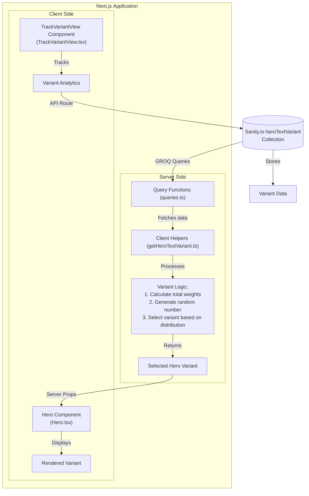

This is a [Next.js](https://nextjs.org) using [Sanity.io](https://www.sanity.io/) to serve a dynamic hero section.

## Project Documentation
- [Setup Instructions](./docs/setup.md)
- [User Stories](./docs/user-stories.md)

## Architecture Diagram

